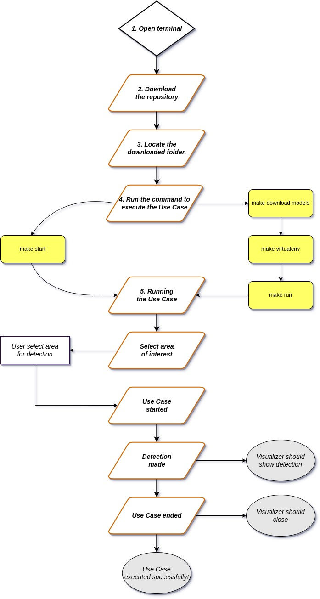

==========================
## DBA Dummy
==========================

## Use Case and High-Level Description:

The application uses the inference engine included in the Intel® Distribution of OpenVINO™ toolkit and is designed to detect and track faces.  
Face detector based on MobileNetV2 as a backbone with a single SSD head for indoor/outdoor scenes shot by a front-facing camera. The single SSD head from 1/16 scale feature map has nine clustered prior boxes.

==============================================================================================

## Specification:

Metric                  Value
AP ( WIDER )            84.52%
GFlops                  0.982
MParams                 1.021
Source framework        PyTorch*

Average Precision (AP) is defined as an area under the precision/recall curve. All numbers were evaluated by taking into account only faces bigger than 60 x 60 pixels.

==============================================================================================

## Inputs:

Image, name: input.1, shape: 1, 3, 300, 300 in the format B, C, H, W, where:

B - batch size
C - number of channels
H - image height
W - image width

Expected color order: BGR.

==============================================================================================

## Outputs:

The net outputs blob with shape: 1, 1, 200, 7 in the format 1, 1, N, 7, where N is the number of detected bounding boxes. Each detection has the format [image_id, label, conf, x_min, y_min, x_max, y_max], where:

image_id - ID of the image in the batch
label - predicted class ID (1 - face)
conf - confidence for the predicted class
(x_min, y_min) - coordinates of the top left bounding box corner
(x_max, y_max) - coordinates of the bottom right bounding box corner

==============================================================================================

## Demo usage:

The model can be used in the following demos provided by the Open Model Zoo to show its capabilities:

Gaze Estimation Demo
G-API Gaze Estimation Demo
Interactive Face Detection C++ Demo
G-API Interactive Face Detection Demo
Multi-Channel Face Detection C++ Demo
Object Detection C++ Demo
Object Detection Python\* Demo

==============================================================================================

## Get the code:

Clone the repo and enter the folder:
Clone the repo: git clone git@github.com:lucasGelpi/DBA-Dummy.git
Enter the folder: cd DBA-Dummy

==============================================================================================

## List of commands:

The following commands can be executed inside the repo folder:

make download_models        Download models inside the repo.
run_proyect                 Create and activate the virtual environment. Launch the Use Case.
make start                  Launch all the above commands sequentially.

==============================================================================================

## Diagram:

In this diagram the user can observe a general flow diagram and see how the use case works.

/

==============================================================================================

## Author:

Lucas Gelpi Fedorczuk - *Software Developer Trainee* - [github](https://github.com/lucasGelpi)

==============================================================================================